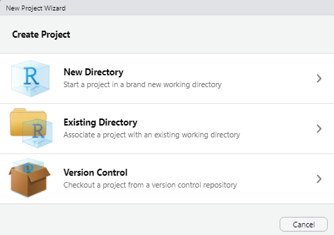
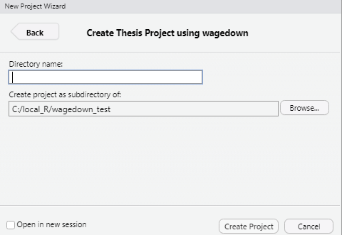

<!-- README.md is generated from README.Rmd via `devtools::build_readme()`. Please edit README.Rmd -->

# Wagedown 

`Wagedown` is an Rmarkdown template for PhD thesis in Wageningen
University, the Netherlands. It’s based on
[thesisdown](http://thesisdown.rbind.io/), and [bookdown
package](https://bookdown.org/yihui/bookdown/).

Currently, the PDF and gitbook versions are fully-functional.

If you are new to working with `rmarkdown`, please also have a look at
some basic introduction videos about
[Rmarkdown](https://rmarkdown.rstudio.com/lesson-1.html).

## Installation

### Initial setup

Using `wagedown` has some prerequisites, such as Pandoc, LaTeX and some
fonts. To compile PDF documents using R, you need to have Pandoc, LaTeX
and several related packages installed. If you have a recent version of
RStudio, then you already have Pandoc and don’t need to do anything more
about that. First setrp is that you need to have
[R](https://www.r-project.org/) and
[Rstudio](https://www.rstudio.com/products/rstudio/download/) installed
in your computer. Becasue RStudio is probably the easiest tool for
writing both R code and text in your thesis. It also provides a nice way
to build your thesis while editing

Next is LaTeX. By far the easiest way to install LaTeX on any platform
is with the tinytex package:

``` r
install.packages(c('tinytex', 'rmarkdown'))
tinytex::install_tinytex()
# after restarting RStudio, confirm that you have LaTeX with
tinytex:::is_tinytex()
```

tinytex will also install some fonts in your computer, therefore it
takes some time.

It is also necessary to install {bookdown} package, you can install it
from CRAN as follows:

``` r
install.packages("bookdown")
```

### install wagedown

1.  Ensure that you have already installed packages described above, and
    are using the latest version of
    [RStudio](https://www.rstudio.com/products/rstudio/download/).

2.  Install the {wagedown} packages. Note that {wagedown} is not
    available on CRAN at the moment and that’s why
    `install.packages("wagedown")` won’t work. Use
    `remotes::install_github()` as shown below instead to install the
    package.

``` r
if (!require("remotes")) 
    install.packages("remotes", repos = "https://cran.rstudio.org")
    remotes::install_github("rstudio/bookdown")
    remotes::install_github("ZhijunWang1991/wagedown")
```

### Start writing from a new project

The most easy way to write your thesis with `wagedown` is to start with
new project.

In RStudio, click on **File** \> **New Project** \> **New Directory**.



Then select **Thesis Project using wagedown** from the dropdown that
will look something like the image below.


Next, give your **project a name** and specify where you’d like the
files to appear.



When you finish your writing, Click “Build Book” from the Build pane to
render the thesis to an output format of your choosing. The PDF file of
your thesis will be deposited in the `_book/` directory, by default.

## Template introduction

The following components are ones you should edit to customize your
thesis:

### `_bookdown.yml`

This is the main configuration file for your thesis. You can change the
name of your outputted file here for your thesis and other options about
your thesis here.

### `index.Rmd`

This file contains all the meta information that goes at the beginning
of your document. You’ll need to edit the top portion of this file (the
YAML) to put your name on the first page, the title of your thesis, etc.
Note that you need to have at least one chapter start in the `index.Rmd`
file for the build to work. For the template, this is done with
`# Introduction` in the example from the template.

### `01-chap1.Rmd`, `02-chap2.Rmd`, etc.

These are the Rmd files for each chapter in your dissertation. Write
your thesis in these. If you’re writing in RStudio, you may find the
[wordcount addin](https://github.com/benmarwick/wordcountaddin) useful
for getting word counts and readability statistics in R Markdown
documents.

### `bib/`

Store your bibliography (as bibtex files) here. We recommend using the
[citr addin](https://github.com/crsh/citr) and
[Mendeley](https://www.mendeley.com/) to efficiently manage and insert
citations.

### `csl/`

Specific style files for bibliographies should be stored here. A good
source for citation styles is
<https://github.com/citation-style-language/styles#readme>.

### `figure/` and `data/`

Store your figures and data here and reference them in your R Markdown
files. See the [bookdown book](https://bookdown.org/yihui/bookdown/) for
details on cross-referencing items using R Markdown.

### `wagethesis.cls`

Currently, there is no offical Latex template for PhD thesis of
Wageningen University. Therefore, this wagethesis is adopted from Monash
University. Many thanks to \[Mushfiqul Anwar Siraji\]
(<https://github.com/masiraji>).

As I know, there is no strict formate requirents for WUR thesis such as
linespace, font size, etc. Therefore, the wagethsis.cls will be updated
from time to time to get a welcome aesthetic effect.

If you have any suggestions and comments, you could use
[issues](https://github.com/ZhijunWang1991/wagedown/issues) to let me
know.

##References

-   `bookdown`, Authoring Books and Technical Documents with
    RMarkdown,Yihui Xie,<https://bookdown.org/yihui/bookdown>.
-   `thesisdown`, Chester Ismay, <https://github.com/ismayc/thesisdown>.
-   `monashthesisdown`,A package for creating undergrad and post-grad
    theses using RMarkdown, Mushfiqul Anwar Siraji,
    <https://github.com/masiraji/monashthesisdown>.
